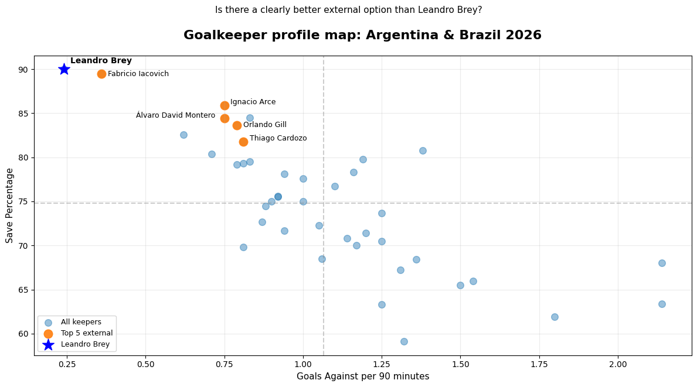
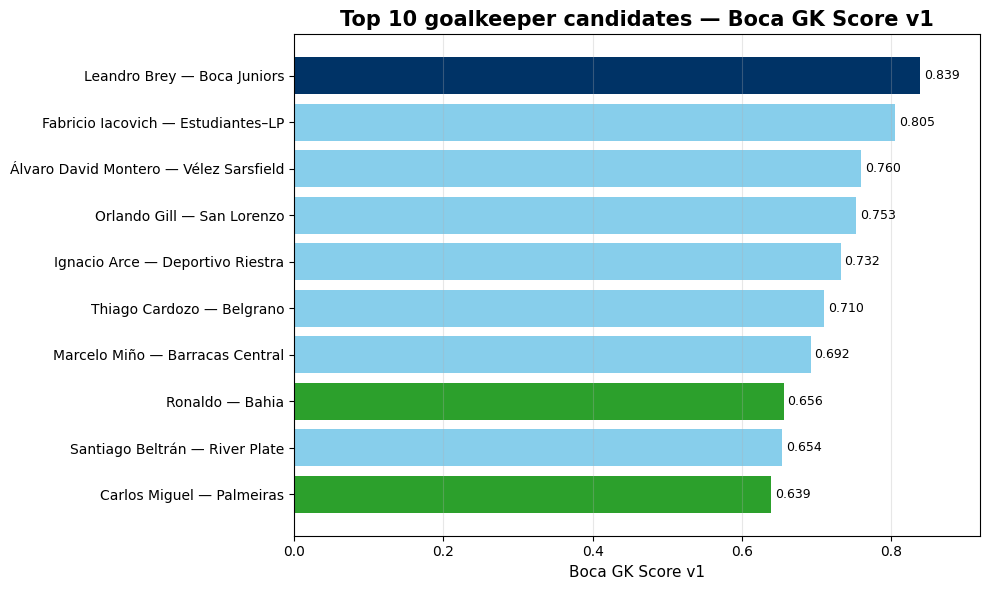

🌐 Available languages: [English](README.md) | [Español](README.es.md) | [Português](README.pt.md)

# Boca Goalkeeper Score

A data-driven screening project to evaluate potential goalkeeper candidates for Boca Juniors using 2026 goalkeeper performance data from Argentina and Brazil.

## Overview

Boca Juniors currently has Leandro Brey as an internal goalkeeper option. Instead of assuming that the club should necessarily go to the transfer market, this project starts from a more specific analytical question:

> Is there a clearly better goalkeeper option than Leandro Brey in Argentina or Brazil based on available 2026 goalkeeper metrics?

The goal is not to produce a definitive recruitment recommendation, but to build an initial, interpretable and reproducible screening framework for goalkeeper comparison.

## Analytical question

**Is there an external goalkeeper in Argentina or Brazil who appears clearly stronger than Leandro Brey according to selected performance indicators?**

## Main conclusion

Based on the Boca GK Score v1, no external goalkeeper from Argentina or Brazil appears to be clearly better than Leandro Brey.

Brey ranks first in the model, with a score of **0.839**, followed by Fabricio Iacovich (**0.805**), Álvaro David Montero (**0.760**) and Orlando Gill (**0.753**).

This does not mean that Boca should not evaluate the goalkeeper market. However, based on this first quantitative screening, the data does not show an obvious external upgrade over Brey.

The strongest external candidates may still be worth monitoring, but they do not clearly outperform Brey within the selected metrics and model assumptions.

## Data source

The analysis uses goalkeeper data exported from FBref for the 2026 season.

The expected input files are:

```text
argentina_keepers_2026.csv
argentina_keepers_advanced_2026.csv
brazil_keepers_2026.csv
brazil_keepers_advanced_2026.csv
```

The project uses both standard and advanced goalkeeper tables from Argentina and Brazil.

## Repository structure

```text
boca-goalkeeper-score/
│
├── README.md
├── notebooks/
│   └── 01_boca_goalkeeper_score.ipynb
├── outputs/
│   └── figures/
├── requirements.txt
└── .gitignore
```

## Methodology

The notebook follows these steps:

1. Load FBref goalkeeper CSV exports.
2. Clean and normalize the exported tables.
3. Merge standard and advanced goalkeeper data.
4. Apply candidate filters.
5. Build a composite goalkeeper score.
6. Rank candidates.
7. Visualize the results.

## Candidate filters

Two filters are applied before scoring:

| Filter | Criteria | Purpose |
|---|---:|---|
| Age | ≤ 34 | Excludes goalkeepers in the final stage of their career |
| Minutes played | ≥ 300 | Removes players with insufficient playing time |

These filters are intended to keep the analysis focused on realistic and minimally representative profiles.

## Boca GK Score v1

The project builds a custom composite index called **Boca GK Score v1**.

All variables are scaled between 0 and 1 using MinMaxScaler before applying the weights.

| Metric | Weight | Direction | Rationale |
|---|---:|---|---|
| Save percentage | 45% | Higher is better | Main shot-stopping indicator |
| Goals against per 90 | 20% | Lower is better | Penalizes goalkeepers who concede more frequently |
| Clean sheet percentage | 15% | Higher is better | Rewards defensive outcomes |
| Minutes played | 10% | Higher is better | Rewards continuity and coach trust |
| Saves per 90 | 5% | Higher is better | Captures actual workload volume |
| Age profile | 5% | Peak between 24 and 31 | Slightly rewards goalkeepers in an ideal age range |

The score is intentionally simple and interpretable. It is designed as a first version that can be improved with more contextual, tactical and scouting information.

## Outputs

The notebook produces:

- A ranked shortlist of goalkeeper candidates.
- A final comparison table.
- A profile map comparing save percentage and goals against per 90.
- A top 10 visual ranking based on Boca GK Score v1.

## Example visualizations

### Goalkeeper profile map

This chart compares goalkeepers by save percentage and goals against per 90 minutes.



### Top 10 goalkeeper candidates

This chart shows the highest-ranked candidates according to the Boca GK Score v1.



## Tools and libraries

- Python
- Pandas
- NumPy
- Matplotlib
- Scikit-learn
- Jupyter Notebook

## How to reproduce

1. Download the required FBref CSV files.
2. Place the files in the same directory as the notebook, or upload them when running the notebook in Google Colab.
3. Open the notebook:

```text
notebooks/01_boca_goalkeeper_score.ipynb
```

4. Run all cells.

Expected input files:

```text
argentina_keepers_2026.csv
argentina_keepers_advanced_2026.csv
brazil_keepers_2026.csv
brazil_keepers_advanced_2026.csv
```

## Data availability

The raw data files are not included in this repository unless their source terms allow redistribution.

To reproduce the analysis, users should download the original CSV exports from FBref and place them in the expected location.

## Limitations

This project should be interpreted as an exploratory data analysis and screening exercise, not as a complete scouting report.

Main limitations:

- The score relies mainly on available goalkeeper metrics.
- Team context is not fully adjusted.
- League strength is not adjusted.
- Defensive structure and tactical role are not directly modeled.
- Contract situation, market value and wages are not included.
- Qualitative scouting is not incorporated.
- Advanced shot-stopping metrics could be further integrated in future versions.

## Next steps

Potential improvements for future versions:

- Incorporate PSxG+/- and other advanced goalkeeper metrics into the score.
- Adjust performance by team and league context.
- Add market value, contract and age-curve analysis.
- Include more leagues.
- Build percentile-based player profiles.
- Compare candidates against historical Boca goalkeeper profiles.
- Add qualitative scouting notes.
- Export final tables and charts automatically.

## Disclaimer

This project is an independent analytical exercise and is not affiliated with Boca Juniors, FBref or any football organization.

The analysis is intended for educational, portfolio and sports analytics purposes.

